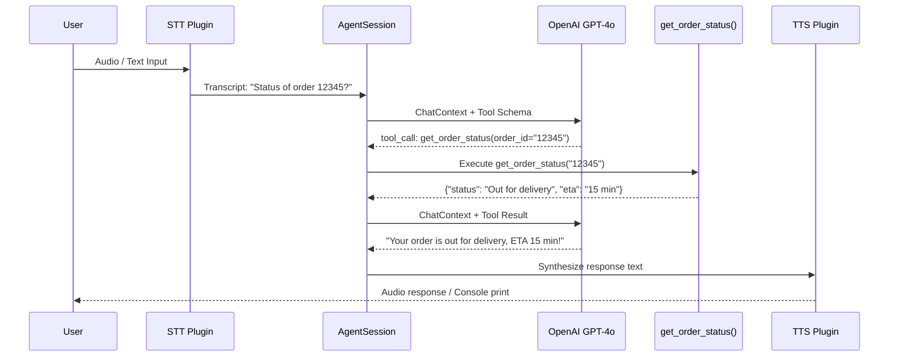

# LiveKit Voice AI Agent — Implementation Plan

> **Role**: Mid-Level AI Engineer Technical Assessment  
> **Stack**: LiveKit Agents Python SDK, OpenAI (LLM), Mock STT/TTS  
> **Goal**: Production-quality minimal Voice AI Agent with tool-calling demonstration

---

## 1. High-Level Architecture

The system follows a **linear pipeline** where user speech is transcribed, reasoned about by an LLM (with optional tool calls), and the response is synthesized back into audio. All of this is orchestrated by the `AgentSession`.

```
┌─────────────────────────────────────────────────────────────────────┐
│                         LiveKit Room (WebRTC)                        │
│                                                                     │
│  [User Microphone] ──► [STT] ──► [LLM + Tools] ──► [TTS] ──► [Speaker] │
│                                       │                             │
│                                  [Tool Registry]                    │
│                                  get_order_status()                 │
└─────────────────────────────────────────────────────────────────────┘
```

### Detailed Flow

```
User speaks
    │
    ▼
[STT Plugin]  ← (Real: Deepgram/Whisper | Mock: text stdin)
    │  Transcript text
    ▼
[AgentSession] receives ChatMessage
    │
    ▼
[LLM Plugin]  ← (ALWAYS REAL: OpenAI GPT-4o)
    │  Detects tool call intent in response
    ▼
[Tool Dispatcher] — calls get_order_status(order_id)
    │  Returns mocked order JSON
    ▼
[LLM Plugin]  ← Second pass: LLM receives tool result, generates final text
    │  Final assistant text
    ▼
[TTS Plugin]  ← (Real: ElevenLabs/OpenAI TTS | Mock: print to stdout)
    │  Audio frames
    ▼
[LiveKit Room] — streams audio to user
```

### Key Architectural Principle

The LLM sits at the **center of the pipeline**. STT feeds it context; TTS consumes its output. The LLM is the only non-replaceable component — it must be real to demonstrate actual tool invocation.

---

## 2. Project Folder Structure

```
livekit-voice-agent/
│
├── agent/
│   ├── __init__.py
│   ├── session.py          # AgentSession wiring (STT → LLM → TTS)
│   ├── persona.py          # System prompt / persona definition
│   └── tools.py            # All @function_tool definitions
│
├── plugins/
│   ├── __init__.py
│   ├── stt.py              # STT plugin selector (real or mock)
│   └── tts.py              # TTS plugin selector (real or mock)
│
├── mocks/
│   ├── __init__.py
│   ├── mock_stt.py         # Text-input based mock STT
│   └── mock_tts.py         # Print-based mock TTS
│
├── config/
│   ├── __init__.py
│   └── settings.py         # Pydantic-based config / env var loader
│
├── tests/
│   ├── test_tools.py       # Unit tests for tool functions
│   └── test_pipeline.py    # Integration test for session flow
│
├── logs/                   # Auto-created at runtime
│   └── agent.log
│
├── .env.example            # Template for required API keys
├── .env                    # Actual secrets (gitignored)
├── .gitignore
├── requirements.txt
├── README.md
└── main.py                 # Entrypoint: starts LiveKit worker
```

> **Why this layout?**  
> - `agent/` contains all business logic (easily unit-testable in isolation).  
> - `plugins/` and `mocks/` are swappable — production vs. mock is a config flag.  
> - `config/settings.py` uses Pydantic `BaseSettings`, giving you automatic `.env` loading and type validation.  
> - `tests/` separated for CI/CD readiness.

---

## 3. Components Breakdown

### 3.1 `main.py` — Entry Point

| Attribute    | Detail |
|---|---|
| **Responsibility** | Bootstrap the LiveKit Worker process, register agent entry-point |
| **Inputs**   | Environment variables (LIVEKIT_URL, LIVEKIT_API_KEY, LIVEKIT_API_SECRET) |
| **Outputs**  | Running worker process listening for room connections |
| **Dependencies** | `livekit-agents`, `config/settings.py` |

The `WorkerOptions` object tells the LiveKit SDK which function to call when a participant joins a room. This is the outermost shell — it holds no business logic.

---

### 3.2 `config/settings.py` — Configuration

| Attribute    | Detail |
|---|---|
| **Responsibility** | Load and validate all environment variables at startup |
| **Inputs**   | `.env` file / OS environment |
| **Outputs**  | A typed `Settings` object consumed app-wide |
| **Dependencies** | `pydantic-settings` |

Key fields:
- `LIVEKIT_URL`, `LIVEKIT_API_KEY`, `LIVEKIT_API_SECRET`
- `OPENAI_API_KEY` (required — LLM is always real)
- `DEEPGRAM_API_KEY` (optional — falls back to mock if absent)
- `ELEVENLABS_API_KEY` (optional — falls back to mock if absent)
- `USE_MOCK_STT: bool = True`
- `USE_MOCK_TTS: bool = True`
- `LOG_LEVEL: str = "INFO"`

---

### 3.3 `agent/persona.py` — System Prompt

| Attribute    | Detail |
|---|---|
| **Responsibility** | Define the agent's identity, role, behavior constraints |
| **Inputs**   | None (static definition) |
| **Outputs**  | A string constant consumed by the LLM plugin |
| **Dependencies** | None |

Example persona content:
> "You are Zara, a friendly support assistant for QuickBite — a fast food delivery application. You help customers track orders, resolve delivery issues, and answer menu questions. Always be concise, empathetic, and professional. When a customer provides an order ID, use the get_order_status tool immediately."

The persona should also specify **tool usage behavior** (e.g., "Always call get_order_status before telling the user their order status.") This prevents the LLM from hallucinating order data.

---

### 3.4 `agent/tools.py` — Function Tools

| Attribute    | Detail |
|---|---|
| **Responsibility** | Define all callable tools exposed to the LLM |
| **Inputs**   | Arguments extracted by the LLM from conversation |
| **Outputs**  | Structured data returned to the LLM for final response generation |
| **Dependencies** | `livekit-agents` (`@function_tool` decorator) |

Tools defined here:
- `get_order_status(order_id: str)` → Returns mocked `OrderStatus` dict
- (Optional extras): `cancel_order()`, `get_eta()`, `list_recent_orders()`

Each tool must:
1. Have a clear **docstring** — the LLM uses it to decide when to call the tool.
2. Perform **input validation** and raise meaningful exceptions on failure.
3. Return a **JSON-serializable** result (dict or Pydantic model).

---

### 3.5 `agent/session.py` — AgentSession Wiring

| Attribute    | Detail |
|---|---|
| **Responsibility** | Compose STT → LLM → TTS into a running session per room connection |
| **Inputs**   | LiveKit `JobContext` (contains room, participant info) |
| **Outputs**  | A live, running `AgentSession` attached to the room |
| **Dependencies** | `plugins/stt.py`, `plugins/tts.py`, LLM plugin, `agent/tools.py`, `agent/persona.py` |

This is the **core orchestration file**. It:
1. Selects real or mock STT/TTS based on config.
2. Instantiates the LLM with the system prompt + registered tools.
3. Creates and starts the `AgentSession`.
4. Connects the session to the LiveKit room.

---

### 3.6 `plugins/stt.py` and `plugins/tts.py` — Plugin Selectors

| Attribute    | Detail |
|---|---|
| **Responsibility** | Return the correct plugin instance (real or mock) based on config |
| **Inputs**   | `Settings` object |
| **Outputs**  | An STT or TTS plugin instance conforming to the LiveKit plugin interface |
| **Dependencies** | `mocks/`, real SDK plugins, `config/settings.py` |

This **factory pattern** ensures that `session.py` never needs to know whether it's running in mock or production mode. You swap the plugin — the session code stays identical.

---

### 3.7 `mocks/mock_stt.py` — Mock STT

| Attribute    | Detail |
|---|---|
| **Responsibility** | Accept text from stdin (or a predefined script) and emit it as STT transcripts |
| **Inputs**   | Text typed in terminal OR hardcoded test utterances |
| **Outputs**  | `SpeechEvent` objects containing the transcript text |
| **Dependencies** | LiveKit Agents STT base class |

Strategy: Subclass `stt.STT` and override the recognition stream. In a loop, read from stdin, wrap it in a `SpeechEvent`, and yield it. This perfectly simulates what a real microphone + Whisper STT would produce.

---

### 3.8 `mocks/mock_tts.py` — Mock TTS

| Attribute    | Detail |
|---|---|
| **Responsibility** | Print synthesized text to stdout instead of generating audio frames |
| **Inputs**   | Text string from the LLM |
| **Outputs**  | Console output (log + print) |
| **Dependencies** | LiveKit Agents TTS base class |

Strategy: Subclass `tts.TTS` and override `synthesize()`. Instead of calling an audio API, log the text and return a single silent audio frame (or empty byte stream). The LLM still runs, tools still get called — only audio output is skipped.

---

## 4. LiveKit Concepts Explained

### `Agent`
The `Agent` class represents your **conversational AI persona**. You subclass it to define:
- The system prompt (via `instructions` parameter or `INSTRUCTIONS` class variable)
- Registered `@function_tool` methods
- Optional lifecycle hooks: `on_enter()`, `on_user_turn_completed()`, `on_agent_turn_completed()`

Think of `Agent` as the **brain's personality and tool kit** — it defines *who* the assistant is and *what it can do*.

### `AgentSession`
The `AgentSession` is the **runtime orchestrator**. It:
- Manages the conversation state (history, turns)
- Routes audio/text through the STT → LLM → TTS pipeline
- Handles turn-taking, barge-in detection, and end-of-utterance detection
- Dispatches tool calls and injects results back into LLM context

Think of `AgentSession` as the **traffic controller** — the `Agent` is a passenger, and `AgentSession` drives the conversation forward.

### `STT` (Speech-to-Text)
Converts raw audio frames (PCM) into text transcripts. The LiveKit SDK provides plugins for:
- **Deepgram** — low latency, ideal for real-time streaming
- **OpenAI Whisper** — high accuracy but higher latency
- **Azure Cognitive Services**, **Google Cloud Speech**

The STT plugin must implement streaming recognition (not batch), so it emits partial and final transcripts continuously.

### `LLM` (Large Language Model)
The LLM receives the full conversation history as messages and generates a response. In the context of LiveKit Agents, the LLM plugin:
- Accepts a `ChatContext` (list of system/user/assistant messages)
- Supports **function/tool calling** natively
- Streams the response token by token (for low-latency TTS triggering)
- Returns `ChatChunk` objects that can contain text OR tool call requests

For this project: **always use OpenAI GPT-4o** (supports tool calling reliably).

### `TTS` (Text-to-Speech)
Converts text strings into audio frames for playback. Plugins include:
- **ElevenLabs** — highly natural voice, supports streaming
- **OpenAI TTS** — fast and consistent
- **Azure Neural TTS**, **Google WaveNet**

The TTS plugin must support **streaming synthesis** — it begins generating audio before the full text is available, reducing perceived latency.

### `Function Tools` (`@function_tool`)
The `@function_tool` decorator marks a method on the `Agent` as callable by the LLM. Behind the scenes, LiveKit Agents:
1. Inspects the method signature and docstring.
2. Generates a **JSON Schema** describing the function (name, parameters, types).
3. Includes this schema in every LLM API call as `tools`.
4. When the LLM returns a `tool_call` in its response, the SDK automatically invokes the Python method.
5. The return value is formatted as a `tool` role message and re-sent to the LLM.

This is a **fully automatic dispatch loop** — you write the Python function; the SDK handles everything else.

---

## 5. Development Roadmap

### Milestone 1 — Project Scaffolding (Day 1)
- Set up virtual environment (`python -m venv .venv`)
- Install dependencies: `livekit-agents`, `livekit-plugins-openai`, `python-dotenv`, `pydantic-settings`
- Create folder structure
- Implement `config/settings.py` with all env var definitions
- Create `.env.example` with all keys documented

**Deliverable**: Project skeleton that imports without errors.

---

### Milestone 2 — Mock STT and Mock TTS (Day 1–2)
- Implement `MockSTT`: reads lines from stdin, emits `SpeechEvent`
- Implement `MockTTS`: receives text, prints to console, returns silent audio
- Write unit test to verify both can be instantiated

**Deliverable**: Text-in, text-out pipeline (no audio required).

---

### Milestone 3 — Define Agent Persona and First Tool (Day 2)
- Write `agent/persona.py` with system prompt
- Implement `get_order_status(order_id: str)` in `agent/tools.py`
  - Returns hardcoded dict for known IDs
  - Raises `ValueError` for invalid/unknown IDs
- Write unit test for `get_order_status` covering valid and invalid cases

**Deliverable**: Persona defined; tool is independently testable in isolation.

---

### Milestone 4 — Wire AgentSession (Day 2–3)
- Implement `agent/session.py`
- Create Agent subclass with persona + registered tool
- Build plugin selectors in `plugins/stt.py` and `plugins/tts.py`
- Wire `AgentSession` with MockSTT + OpenAI LLM + MockTTS
- Implement `main.py` entry point

**Deliverable**: Running agent process that connects to LiveKit room.

---

### Milestone 5 — End-to-End Manual Test (Day 3)
- Start LiveKit development server (Docker or `lk server dev`)
- Connect via LiveKit Playground or custom HTML client
- Type test utterances via MockSTT
- Verify: LLM receives message → calls tool → logs result → responds

**Deliverable**: Tool invocation confirmed in logs.

---

### Milestone 6 — Logging and Write-up (Day 3–4)
- Add structured logging with `structlog` or `logging`
- Log: session start, every STT transcript, every LLM tool call (name + args), every tool result, every TTS output
- Write `README.md` covering barge-in, adding tools, and error handling

**Deliverable**: Complete, submission-ready project.

---

### Milestone 7 — (Optional) Real STT/TTS Integration (Day 4–5)
- Add Deepgram plugin for STT
- Add ElevenLabs or OpenAI TTS plugin
- Test with actual microphone input
- Benchmark end-to-end latency

**Deliverable**: Full voice pipeline.

---

## 6. Tool Calling Flow

When a user says *"What's the status of order 12345?"*, the following sequence occurs:

```
User utterance: "What's the status of order 12345?"
          │
          ▼
  [STT Plugin]
  Outputs transcript: "What's the status of order 12345?"
          │
          ▼
  [AgentSession]
  Appends to ChatContext as { role: "user", content: "What's the status of order 12345?" }
          │
          ▼
  [LLM Plugin — OpenAI GPT-4o]
  Receives:
    - System prompt (persona)
    - Conversation history
    - Tool schema for get_order_status(order_id: str)
  
  Outputs:
    { role: "assistant", tool_calls: [{ name: "get_order_status", arguments: { "order_id": "12345" } }] }
          │
          ▼
  [LiveKit Tool Dispatcher]
  Detects tool_call in LLM response
  Looks up "get_order_status" in Agent's tool registry
  Calls: agent.get_order_status(order_id="12345")
          │
          ▼
  [tools.py: get_order_status("12345")]
  Executes mocked lookup
  Returns: { "order_id": "12345", "status": "Out for delivery", "eta": "15 minutes" }
  *** LOGS TOOL INVOCATION HERE ***
          │
          ▼
  [AgentSession]
  Appends tool result to ChatContext:
    { role: "tool", tool_call_id: "...", content: '{"order_id": "12345", "status": "Out for delivery", "eta": "15 minutes"}' }
          │
          ▼
  [LLM Plugin — Second Pass]
  Receives full updated context including tool result
  Generates final natural language response:
    "Your order #12345 is currently out for delivery and should arrive in about 15 minutes!"
          │
          ▼
  [TTS Plugin]
  Synthesizes audio (or prints if mock)
          │
          ▼
  [LiveKit Room]
  Streams audio to user
```

### Sequence Diagram (Mermaid)



---

## 7. Mock Strategy

| Component | Strategy | Justification |
|---|---|---|
| **STT** | **Mock** (stdin text) | No Deepgram key needed; demonstrates pipeline identically |
| **TTS** | **Mock** (stdout print) | No ElevenLabs key needed; LLM output is still visible |
| **LLM** | **REAL** (OpenAI GPT-4o) | Tool-calling decision must be genuine; cannot fake this |
| **Tool execution** | **Mock data** (hardcoded dict) | Database/API not in scope; logic is testable |
| **LiveKit room** | **Real** (dev server) | Room is required for agent process to start |

### Mock Acceptance Criteria
The mocks are acceptable **if and only if**:
1. The LLM receives the correct `ChatContext` (same as real pipeline).
2. The tool is invoked with the correct arguments extracted by the LLM.
3. The tool result is correctly re-injected into the LLM context.
4. The final LLM response is observable (logged/printed).

Meeting these criteria proves the pipeline works end-to-end — audio I/O is a delivery mechanism, not the core logic being assessed.

---

## 8. Logging Strategy

Use Python's `logging` module with a structured format. Every log line should include: timestamp, level, component name, and message.

### What to log at each stage

| Stage | Log Level | Message Example |
|---|---|---|
| Session start | `INFO` | `AgentSession started. Room: <room_name>. Participant: <identity>` |
| STT transcript received | `INFO` | `STT transcript: "What's the status of order 12345?"` |
| LLM request sent | `DEBUG` | `LLM request: messages=3, tools=1` |
| **Tool call detected** | `INFO` | `🔧 Tool invoked: get_order_status(order_id='12345')` |
| **Tool result** | `INFO` | `🔧 Tool result: {"status": "Out for delivery", "eta": "15 min"}` |
| Tool error | `ERROR` | `Tool get_order_status failed: ValueError: Unknown order ID 'abc'` |
| LLM final response | `INFO` | `LLM response: "Your order is out for delivery..."` |
| TTS output | `DEBUG` | `TTS (mock): "Your order is out for delivery..."` |
| Session end | `INFO` | `AgentSession ended. Duration: 45s` |

### Proof of Tool Invocation
The `INFO` log lines for "Tool invoked" and "Tool result" are your **primary evidence** for the grader. These must appear in the log output during the demo. Consider also writing logs to a file (`logs/agent.log`) so they can be included in the submission as a screenshot or log file.

---

## 9. Testing Strategy

### Unit Tests (Automated)

**`tests/test_tools.py`**
- Test `get_order_status("ORD-001")` → returns dict with expected keys
- Test `get_order_status("")` → raises `ValueError`
- Test `get_order_status("UNKNOWN-999")` → raises `ValueError` or returns "not found" status
- Test return value is JSON-serializable (call `json.dumps()` on result)

**`tests/test_pipeline.py`**
- Mock the LLM client to return a hardcoded tool_call response
- Verify that the tool dispatcher calls `get_order_status` with the correct argument
- Verify that the tool result is appended to `ChatContext`

### Manual Tests (End-to-End)

**Test 1 — Basic Greeting**
- Input: "Hello, who are you?"
- Expected: Agent introduces itself as Zara / QuickBite assistant
- Verify: No tool call in logs

**Test 2 — Order Status (Happy Path)**
- Input: "I need to check on order 12345"
- Expected: Agent calls `get_order_status("12345")` and reads back status
- Verify: `🔧 Tool invoked` appears in log

**Test 3 — Order Status (Invalid ID)**
- Input: "What about order FAKE-ID?"
- Expected: Agent gracefully says it couldn't find that order
- Verify: `ERROR Tool get_order_status failed` in log, agent doesn't crash

**Test 4 — Non-Order Question**
- Input: "What time do you close?"
- Expected: Agent responds without calling any tool
- Verify: No tool call in logs

**Test 5 — Ambiguous Order ID**
- Input: "Check my order" (no ID given)
- Expected: Agent asks for the order ID
- Verify: Tool NOT called (LLM doesn't have required arg), clarifying question in response

### Test Execution
```
# Run all unit tests
pytest tests/ -v

# Run with log output visible
pytest tests/ -v -s
```

---

## 10. Possible Challenges

### Challenge 1: Tool Not Being Called by LLM
**Mistake**: Writing a vague docstring for the tool.  
**Fix**: The LLM uses docstrings to decide when to call a tool. Write explicit, example-driven docstrings:  
> "Call this tool to retrieve the current delivery status of a customer's order. Requires a valid order_id (e.g., '12345'). Always call this before reporting order status to a user."

---

### Challenge 2: Session Never Starting
**Mistake**: Not calling `session.start()` and `await ctx.connect()` in the correct order.  
**Fix**: Follow the LiveKit Agents quickstart pattern exactly. The agent entry function must be async and registered with `WorkerOptions`.

---

### Challenge 3: MockSTT Never Emitting Events
**Mistake**: Implementing the mock incorrectly — blocking the event loop with `input()`.  
**Fix**: Use `asyncio.get_event_loop().run_in_executor(None, input)` to read stdin without blocking. The LiveKit Agents SDK is fully async.

---

### Challenge 4: Tool Result Not Injected into LLM Context
**Mistake**: Returning tool results in a format the SDK doesn't understand.  
**Fix**: Always return a dict or a JSON-serializable Pydantic model. The SDK handles serialization automatically.

---

### Challenge 5: Barge-in Interrupting Mid-Sentence Incorrectly
**Mistake**: Assuming barge-in works out of the box with all TTS providers.  
**Fix**: Barge-in requires the AgentSession's `allow_interruptions=True` parameter AND a TTS plugin that supports stream cancellation. Verify your TTS plugin cancels ongoing synthesis cleanly.

---

### Challenge 6: Environment Variables Not Loaded
**Mistake**: Forgetting to call `load_dotenv()` or not setting `LIVEKIT_URL`.  
**Fix**: Use `pydantic-settings` which auto-loads from `.env` files without manual `load_dotenv()` calls.

---

### Challenge 7: LiveKit Dev Server Not Running
**Mistake**: Starting the agent before the LiveKit server is running.  
**Fix**: Always start LiveKit server first (`docker-compose up` or `lk server dev`), then start the agent worker.

---

### Challenge 8: Type Mismatch in Tool Parameters
**Mistake**: Declaring `order_id: int` when the LLM naturally passes `"12345"` as a string.  
**Fix**: Always use `str` for ID parameters. Add explicit type coercion inside the tool if needed.

---

## 11. Future Improvements

### Short-Term (Production-Readiness)

| Improvement | Description |
|---|---|
| **Real STT** | Replace MockSTT with Deepgram streaming plugin for live voice |
| **Real TTS** | Replace MockTTS with ElevenLabs for natural, human-like voice |
| **Conversation memory** | Persist `ChatContext` to Redis so users can continue across sessions |
| **Auth/Identity** | Verify participant identity via LiveKit JWT tokens |
| **Rate limiting** | Limit LLM calls per user per minute to control costs |

### Medium-Term (Feature Expansion)

| Improvement | Description |
|---|---|
| **Multiple tools** | Add `cancel_order()`, `get_menu()`, `submit_complaint()` |
| **Multi-turn context** | Implement context compression for long conversations |
| **Sentiment analysis** | Detect frustrated users and escalate to human agent |
| **Multilingual support** | Add language detection + multilingual STT/TTS |
| **Analytics dashboard** | Track tool call frequency, conversation duration, error rates |

### Long-Term (Production AI System)

| Improvement | Description |
|---|---|
| **RAG integration** | Connect to a vector database (Pinecone/Weaviate) for dynamic knowledge |
| **Real backend APIs** | Replace mock tool data with real order management API calls |
| **A/B testing** | Run multiple agent personas in parallel, measure satisfaction |
| **Voice cloning** | Use ElevenLabs voice cloning for branded assistant voice |
| **Observability** | Integrate OpenTelemetry for full distributed tracing |
| **Load testing** | Stress-test with multiple concurrent sessions using LiveKit's multi-room support |

---

## 12. Trade-offs

### Why Mocking STT/TTS is Acceptable

#### Engineering Argument
The LiveKit Agents pipeline is **interface-driven**. The `AgentSession` communicates with STT and TTS plugins through well-defined abstract interfaces. Whether the STT plugin connects to Deepgram's WebSocket API or reads from stdin, the downstream components (`AgentSession`, `LLM`, tools) receive **identical data structures** (`SpeechEvent`, `ChatMessage`).

Replacing a mock with a real plugin is a one-line config change — it does not affect any other component. This is the **plugin architecture's fundamental value proposition**.

#### Assessment-Specific Argument

| What is being assessed | Requires real STT/TTS? |
|---|---|
| LLM integration | ❌ No |
| Tool-calling implementation | ❌ No |
| Tool dispatch correctness | ❌ No |
| Pipeline wiring | ❌ No |
| System design quality | ❌ No |
| Voice naturalness | ✅ Yes (but not assessed here) |
| Audio streaming latency | ✅ Yes (but not assessed here) |

Every core requirement of this assessment can be fully demonstrated with mock I/O plugins.

#### Cost Argument
Real-time STT (Deepgram) and TTS (ElevenLabs) have **per-character/per-minute API costs**. Using mocks during development and testing eliminates unnecessary spend while achieving identical logical coverage.

#### Risk Argument
Mock components eliminate a class of failure modes (network timeouts, API rate limits, audio device errors) that would obscure the actual logic being demonstrated. A clean, reliable mock demo is more impressive than a shaky real-audio demo that fails due to environmental factors.

---

## Appendix A: Barge-in Support

Barge-in means the user can interrupt the agent mid-response.

### How to Enable
Set `allow_interruptions=True` when constructing `AgentSession`. This tells the SDK to:
1. **Continue STT** even while TTS audio is playing.
2. **Detect voice activity** from the user (VAD — Voice Activity Detection).
3. **Cancel ongoing TTS synthesis** and return the floor to the user.

### Key Components Required
- **VAD (Voice Activity Detector)**: Usually Silero VAD, included in LiveKit SDK. Detects when user starts speaking.
- **Interruptible TTS plugin**: Must support `synthesize()` stream cancellation. ElevenLabs and OpenAI TTS do.
- **Conversation state management**: `AgentSession` handles this internally — it tracks whose "turn" it is.

### Nuance
Barge-in can trigger **false positives** (background noise detected as user speech). Tune the VAD threshold and minimum speech duration to reduce this. Also consider setting a minimum playback duration before barge-in is allowed (e.g., agent must speak for at least 1 second before user can interrupt).

---

## Appendix B: How to Safely Add Another Tool

1. **Open `agent/tools.py`**
2. **Define a new method** on the `Agent` subclass decorated with `@function_tool`
3. **Write a precise docstring** explaining when the LLM should call this tool
4. **Specify typed parameters** with descriptive names
5. **Add error handling** (try/except, return error message string or raise)
6. **Add a unit test** in `tests/test_tools.py`
7. **Update the system prompt** if the new tool changes the agent's capabilities in ways the LLM should know about
8. **Test with the manual test case** that specifically exercises the new tool

No changes are needed to `session.py`, `main.py`, or any other file. The `@function_tool` decorator registers the tool automatically with the `AgentSession`.

---

## Appendix C: Error Handling Strategy for Tool Failures

### Approach 1: Return Error Message (Recommended for user-facing errors)
The tool catches the exception and returns a structured error dict. The LLM receives this as a valid tool result and formulates a polite error message.

```
Tool raises ValueError → Tool catches it → Returns {"error": "Order not found", "code": 404}
→ LLM generates: "I'm sorry, I couldn't find order #XYZ. Please double-check the number."
```

### Approach 2: Raise Exception (For unexpected/internal errors)
Let the exception propagate. The LiveKit SDK catches it, logs it, and injects an error signal into the conversation. The agent should then apologize and offer to retry.

### Best Practice
- **Validation errors** (invalid format, missing field): Catch, return structured error, let LLM handle gracefully.
- **External API failures** (database timeout, 500 error): Raise, log with full traceback, trigger fallback message.
- **Unexpected exceptions**: Always have a top-level `try/except Exception` in each tool that logs the full error before re-raising or returning a fallback.
