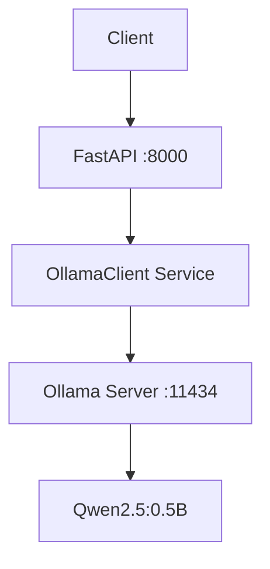

# Task 4.1 — Model Deployment


## Overview

This project implements a production-ready REST API for LLM inference using **FastAPI** and **Ollama**, deploying the **Qwen2.5:0.5B** model. 

It satisfies all requirements of **Section 4 — Model Deployment** of the Electro Pi AI Engineer Technical Test.

## Architecture



## Prerequisites
- Docker Engine
- OR Python 3.11+ and Ollama installed locally.

## Quick Start (Docker)

To run everything in a single container:

```bash
docker build -t section4 .
docker run -p 8000:8000 section4
```

Verify it's healthy:
```bash
curl http://localhost:8000/health
```

## API Reference

| Method | Endpoint | Description | Streaming |
|---|---|---|---|
| GET | `/health` | API Health Check | No |
| POST | `/api/v1/generate` | Blocking Generation | No |
| POST | `/api/v1/stream` | Streaming Generation | **Yes** |

### Streaming Example

```bash
curl -N -X POST http://localhost:8000/api/v1/stream \
     -H "Content-Type: application/json" \
     -d '{"prompt": "What is MLOps?"}'
```

## Configuration (Environment Variables)

| Variable | Default | Description |
|---|---|---|
| `OLLAMA_HOST` | `http://127.0.0.1:11434` | Ollama connection |
| `MODEL_NAME` | `qwen2.5:0.5b` | Target model |
| `API_PORT` | `8000` | Bind port |
| `LOG_LEVEL` | `info` | Logging verbosity |

## Benchmark

A benchmark suite is provided to measure Time-To-First-Token (TTFT) and total latency under 10 concurrent requests.

```bash
python -m benchmark.runner
```

## Production Scaling (50 Users)

To scale to 50 concurrent users:
1. **vLLM**: Replace Ollama with vLLM for continuous batching and GPU utilization.
2. **Horizontal Pod Autoscaling**: Run 3-10 replicas of the FastAPI application.
3. **Queue / Message Broker**: Use Redis or RabbitMQ to queue inference requests during bursts.
4. **Caching**: Implement a semantic cache (e.g. Redis) to reuse identical responses.

## Deployment Justification

FastAPI + Ollama is chosen over HuggingFace TGI / vLLM here because it is extremely lightweight, requires no GPU (runs great on CPU for 0.5B models), and can be fully containerized in a single, simple Docker setup for this technical assessment.

## Project Structure

```
app/             # FastAPI Application
benchmark/       # Asyncio load testing scripts
docker/          # Container scripts
tests/           # Pytest test suite
```
