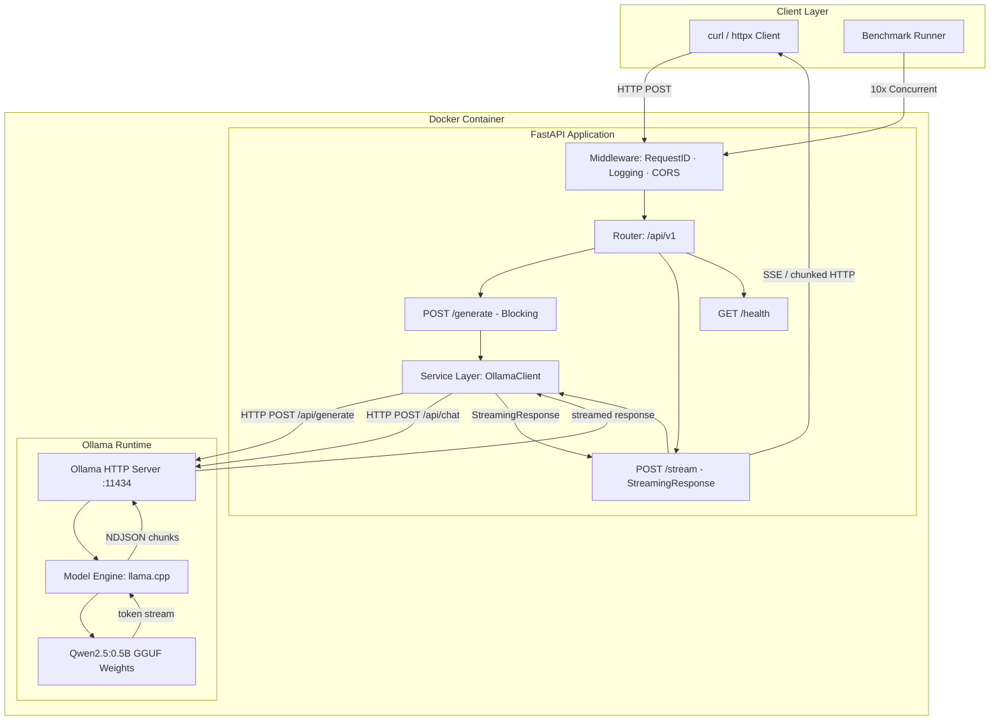
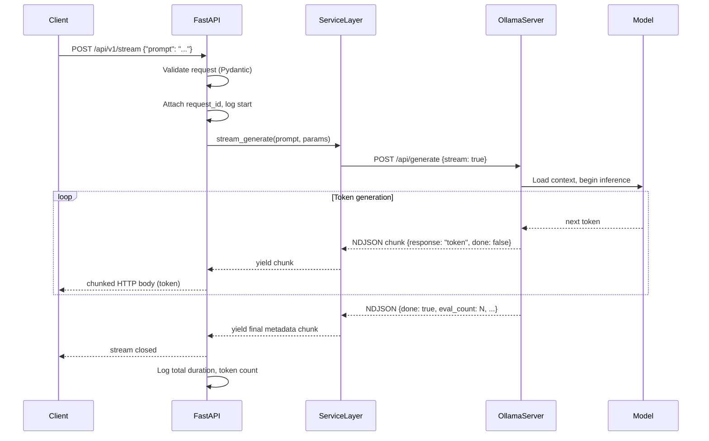
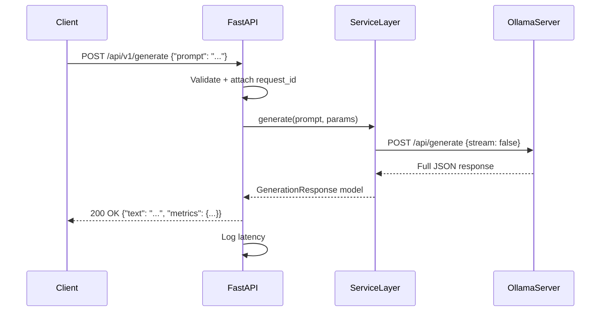
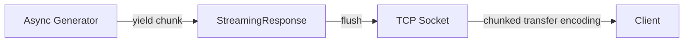
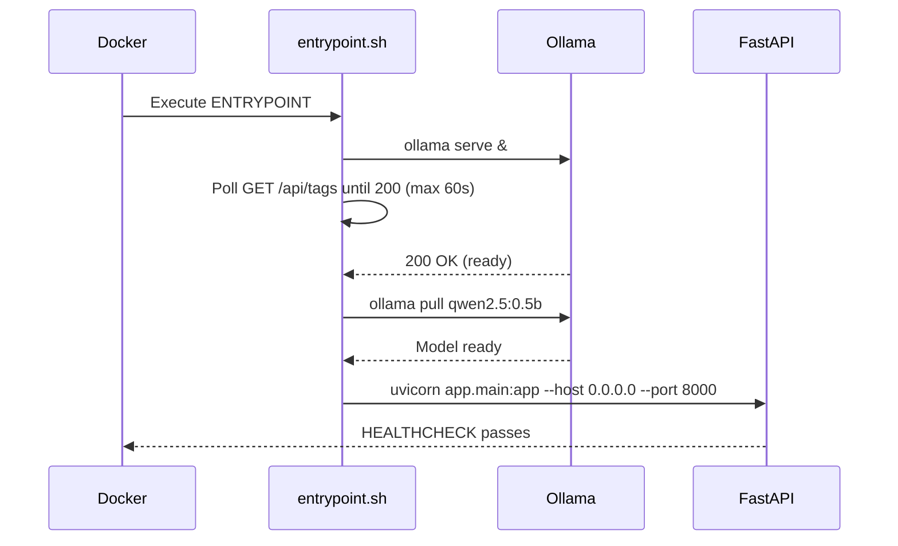
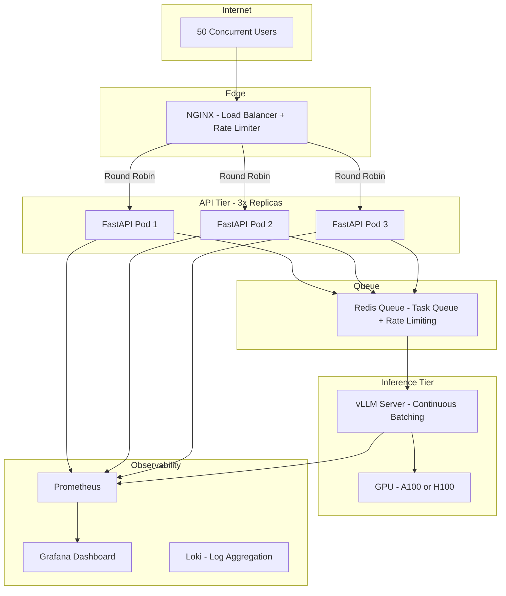
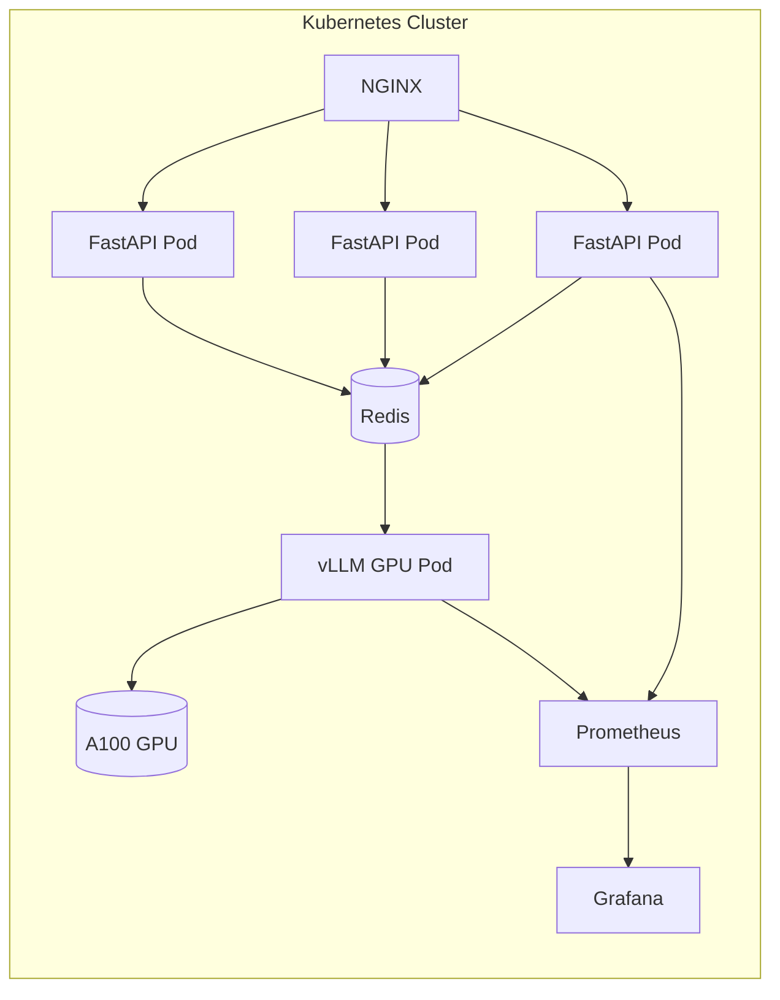

# Task 4.1 — Model Deployment: Implementation Plan

> **Engineering Design Document**  
> Author: Senior AI / Backend / MLOps Engineer  
> Assignment: Electro Pi — AI Engineer Technical Test  
> Section: 4 — Model Deployment  
> Model: Qwen2.5:0.5B via Ollama  
> Stack: Python 3.11 · FastAPI · Docker · asyncio + httpx  

---

## Table of Contents

1. [Deployment Justification](#1-deployment-justification)
2. [High-Level Architecture](#2-high-level-architecture)
3. [Folder Structure](#3-folder-structure)
4. [Development Phases](#4-development-phases)
5. [API Design](#5-api-design)
6. [Streaming Design](#6-streaming-design)
7. [Docker Plan](#7-docker-plan)
8. [Benchmark Plan](#8-benchmark-plan)
9. [Error Handling](#9-error-handling)
10. [Logging Strategy](#10-logging-strategy)
11. [Configuration Management](#11-configuration-management)
12. [Production Improvements (50 Concurrent Users)](#12-production-improvements)
13. [Testing Strategy](#13-testing-strategy)
14. [README Plan](#14-readme-plan)
15. [Deliverables Checklist](#15-deliverables-checklist)

---

## 1. Deployment Justification

### Why FastAPI + Ollama (Not vLLM or HuggingFace TGI)?

| Criterion | FastAPI + Ollama | vLLM | HuggingFace TGI |
|---|---|---|---|
| **Model size** | Ideal for ≤ 7B models | Optimized for large models (13B+) | Works, but heavy overhead |
| **Hardware requirement** | CPU-capable, GPU optional | Requires CUDA GPU | Requires GPU for meaningful performance |
| **Setup complexity** | Minimal — single binary | Complex CUDA setup | Moderate; Docker image is large |
| **Streaming support** | Native via Ollama `/api/generate` | Yes (continuous batching) | Yes (SSE) |
| **Containerization** | Lightweight; Ollama binary fits in one image | Large images (10+ GB) | Large images |
| **Qwen2.5 support** | First-class support in Ollama | Supported via custom engine | Supported |
| **Interview context** | Demonstrates full-stack ability | Overkill for 0.5B | Overkill for demo context |
| **Customization** | Full control over middleware, auth, logging | Limited middleware hooks | Limited |

**Decision**: FastAPI + Ollama is the correct pragmatic choice for a 0.5B model in a technical interview context. It demonstrates architectural thinking (service layer, streaming, Docker), works on any machine (no GPU required), and keeps the focus on engineering quality over raw throughput tooling.

> For 50+ concurrent users at production scale, the architecture would evolve toward vLLM with continuous batching — see Section 12.

---

## 2. High-Level Architecture

### 2.1 Component Overview

| Component | Technology | Role |
|---|---|---|
| **Client** | curl / httpx / browser | Sends HTTP requests; consumes streaming SSE |
| **FastAPI App** | Python 3.11 + Uvicorn | Request routing, validation, middleware |
| **Service Layer** | Python (OllamaClient class) | Business logic; decouples API from inference engine |
| **Ollama Server** | Ollama binary (v0.3+) | LLM inference engine; exposes HTTP API on port 11434 |
| **Model** | Qwen2.5:0.5B (GGUF) | Quantized LLM weights loaded by Ollama |
| **Docker** | Docker Engine | Containerizes both FastAPI and Ollama in one image |
| **Benchmark Runner** | asyncio + httpx | Measures TTFT and total latency under concurrency |

---

### 2.2 System Architecture Diagram



---

### 2.3 Request Flow — Streaming Endpoint



---

### 2.4 Request Flow — Blocking Endpoint



---

## 3. Folder Structure

```
section4-model-deployment/
│
├── app/                          # FastAPI application package
│   ├── __init__.py
│   ├── main.py                   # FastAPI app factory, middleware registration
│   ├── config.py                 # Settings via pydantic-settings + env vars
│   │
│   ├── api/                      # Route definitions (thin controllers)
│   │   ├── __init__.py
│   │   ├── v1/
│   │   │   ├── __init__.py
│   │   │   ├── router.py         # Aggregates all v1 routes
│   │   │   ├── generate.py       # POST /generate — blocking
│   │   │   ├── stream.py         # POST /stream — StreamingResponse
│   │   │   └── health.py         # GET /health
│   │
│   ├── services/                 # Business logic & inference abstractions
│   │   ├── __init__.py
│   │   └── ollama_client.py      # OllamaClient: wraps Ollama HTTP API
│   │
│   ├── schemas/                  # Pydantic request/response models
│   │   ├── __init__.py
│   │   ├── generate.py           # GenerateRequest, GenerateResponse
│   │   └── health.py             # HealthResponse
│   │
│   ├── middleware/               # Custom ASGI middleware
│   │   ├── __init__.py
│   │   ├── request_id.py         # Inject X-Request-ID header
│   │   └── logging_middleware.py # Log every request + latency
│   │
│   └── utils/
│       ├── __init__.py
│       └── logger.py             # Structured JSON logger setup
│
├── benchmark/                    # Load & latency testing
│   ├── runner.py                 # asyncio + httpx concurrent benchmark
│   ├── report.py                 # Aggregates results, prints table
│   └── results/                  # Output directory for benchmark JSON/CSV
│       └── .gitkeep
│
├── tests/                        # All test suites
│   ├── unit/
│   │   ├── test_ollama_client.py
│   │   └── test_schemas.py
│   ├── integration/
│   │   ├── test_generate_endpoint.py
│   │   ├── test_stream_endpoint.py
│   │   └── test_health_endpoint.py
│   └── conftest.py               # Shared fixtures (mock Ollama server)
│
├── docker/
│   ├── entrypoint.sh             # Container startup script
│   └── healthcheck.sh            # Docker HEALTHCHECK script
│
├── Dockerfile                    # Multi-stage Docker build
├── docker-compose.yml            # Optional local orchestration
├── requirements.txt              # Runtime dependencies
├── requirements-dev.txt          # Dev/test dependencies
├── .env.example                  # Environment variable template
├── .dockerignore                 # Build context exclusions
├── .gitignore
└── README.md                     # Project documentation
```

### Folder Responsibilities

| Path | Responsibility |
|---|---|
| `app/main.py` | App factory: creates FastAPI instance, registers middleware, mounts routers |
| `app/config.py` | Single source of truth for all configuration; reads from env vars |
| `app/api/v1/` | Thin route handlers — only validation, delegation, response shaping |
| `app/services/ollama_client.py` | All Ollama HTTP communication logic; async httpx client |
| `app/schemas/` | Pydantic v2 models for strict input validation and response serialization |
| `app/middleware/` | Cross-cutting concerns (IDs, logging) applied before routes |
| `app/utils/logger.py` | Configures structlog or Python logging for JSON-structured output |
| `benchmark/` | Self-contained benchmark system; requires only running API |
| `tests/` | Pytest test suite; isolated from app via dependency injection |
| `docker/entrypoint.sh` | Starts Ollama server, pulls model, starts Uvicorn — all in one container |

---

## 4. Development Phases

### Phase 1 — Project Setup

| Field | Detail |
|---|---|
| **Objective** | Establish a clean, reproducible development environment |
| **Tasks** | Create folder structure · Initialize `requirements.txt` · Set up `.env.example` · Configure `pyproject.toml` or `setup.cfg` · Initialize git · Create base `config.py` with pydantic-settings |
| **Deliverables** | Runnable empty FastAPI app on `uvicorn app.main:app` |
| **Dependencies** | Python 3.11, Ollama installed locally |
| **Estimated Time** | 30 minutes |

---

### Phase 2 — Inference Abstraction (Service Layer)

| Field | Detail |
|---|---|
| **Objective** | Build the `OllamaClient` class that abstracts all Ollama HTTP communication |
| **Tasks** | Implement `generate()` (blocking) · Implement `stream_generate()` (async generator) · Handle connection errors · Parse Ollama NDJSON response format · Unit test with mocked httpx responses |
| **Deliverables** | `app/services/ollama_client.py` with 100% unit test coverage |
| **Dependencies** | Phase 1, Ollama running locally, `httpx[asyncio]` |
| **Estimated Time** | 1.5 hours |

---

### Phase 3 — REST API

| Field | Detail |
|---|---|
| **Objective** | Implement all API endpoints behind structured routes |
| **Tasks** | Define Pydantic schemas · Implement `/generate` (blocking) · Implement `/health` · Implement request-ID middleware · Implement logging middleware · Wire router into main.py · Add CORS middleware |
| **Deliverables** | Working `/generate` and `/health` endpoints; integration tests pass |
| **Dependencies** | Phase 2 |
| **Estimated Time** | 2 hours |

---

### Phase 4 — Streaming Endpoint

| Field | Detail |
|---|---|
| **Objective** | Implement the `/stream` endpoint with real token-by-token streaming |
| **Tasks** | Implement async generator in `OllamaClient.stream_generate()` · Wrap with FastAPI `StreamingResponse` · Set `media_type="text/event-stream"` · Format each chunk as `data: {json}\n\n` · Handle `done: true` termination · Test streaming behavior with integration tests |
| **Deliverables** | `/stream` endpoint verified with `curl --no-buffer` |
| **Dependencies** | Phase 3 |
| **Estimated Time** | 1.5 hours |

---

### Phase 5 — Dockerization

| Field | Detail |
|---|---|
| **Objective** | Produce a single Docker image that runs Ollama + FastAPI together |
| **Tasks** | Write `Dockerfile` (multi-stage, Python 3.11-slim base) · Write `docker/entrypoint.sh` (start Ollama → pull model → start Uvicorn) · Write `.dockerignore` · Add `HEALTHCHECK` instruction · Verify `docker build && docker run` works end-to-end · Test all endpoints inside container |
| **Deliverables** | Container that passes `docker build -t section4 . && docker run -p 8000:8000 section4` |
| **Dependencies** | Phase 4 |
| **Estimated Time** | 1.5 hours |

---

### Phase 6 — Benchmark

| Field | Detail |
|---|---|
| **Objective** | Measure TTFT and total latency under 10 concurrent requests |
| **Tasks** | Implement `benchmark/runner.py` using asyncio + httpx · Measure TTFT per request · Measure total latency per request · Aggregate results (min/max/avg/p95) · Generate console table output · Save results to JSON/CSV in `benchmark/results/` |
| **Deliverables** | `benchmark/runner.py` that prints a formatted report and saves results |
| **Dependencies** | Phase 5 (running container or local server) |
| **Estimated Time** | 1 hour |

---

### Phase 7 — Documentation & Production Write-Up

| Field | Detail |
|---|---|
| **Objective** | Write complete README and production scaling write-up |
| **Tasks** | Write README following the plan in Section 14 · Write production section explaining 50-user scaling · Document all endpoints · Document benchmark results with actual numbers · Add architecture diagram to README |
| **Deliverables** | `README.md` fully written; production write-up embedded |
| **Dependencies** | Phase 6 (actual benchmark results) |
| **Estimated Time** | 1 hour |

---

### Phase Summary

```mermaid
gantt
    title Implementation Timeline
    dateFormat HH:mm
    axisFormat %H:%M

    section Setup
    Phase 1 Project Setup        :p1, 00:00, 30m

    section Core
    Phase 2 Inference Abstraction :p2, after p1, 90m
    Phase 3 REST API              :p3, after p2, 120m
    Phase 4 Streaming             :p4, after p3, 90m

    section Deployment
    Phase 5 Docker                :p5, after p4, 90m

    section Validation
    Phase 6 Benchmark             :p6, after p5, 60m
    Phase 7 Documentation         :p7, after p6, 60m
```



**Total Estimated Time: ~8 hours**

---

## 5. API Design

### 5.1 Endpoint Summary

| Method | Path | Description | Streaming |
|---|---|---|---|
| `GET` | `/health` | Service health check | No |
| `GET` | `/api/v1/models` | List available models | No |
| `POST` | `/api/v1/generate` | Blocking text generation | No |
| `POST` | `/api/v1/stream` | Streaming text generation | **Yes** |

---

### 5.2 `GET /health`

| Field | Detail |
|---|---|
| **Purpose** | Verify the API is alive and Ollama is reachable |
| **Method** | `GET` |
| **Request Body** | None |
| **Response Body** | `{"status": "ok", "ollama": "reachable", "model": "qwen2.5:0.5b", "version": "1.0.0"}` |
| **Status Codes** | `200 OK` — healthy; `503 Service Unavailable` — Ollama unreachable |
| **Validation** | None |
| **Error Handling** | Catches `httpx.ConnectError`; returns 503 with error message |
| **Streaming** | No |

---

### 5.3 `GET /api/v1/models`

| Field | Detail |
|---|---|
| **Purpose** | List all models available in the Ollama runtime |
| **Method** | `GET` |
| **Request Body** | None |
| **Response Body** | `{"models": [{"name": "qwen2.5:0.5b", "size": "...", "modified_at": "..."}]}` |
| **Status Codes** | `200 OK`; `503` if Ollama unreachable |
| **Validation** | None |
| **Error Handling** | Propagates Ollama errors as 503 |
| **Streaming** | No |

---

### 5.4 `POST /api/v1/generate`

| Field | Detail |
|---|---|
| **Purpose** | Send a prompt and receive the complete generated text in one response |
| **Method** | `POST` |
| **Content-Type** | `application/json` |
| **Request Body** | See schema below |
| **Response Body** | See schema below |
| **Status Codes** | `200 OK`; `422 Unprocessable Entity` (validation); `503` (Ollama down); `500` (unexpected) |
| **Validation** | `prompt`: required, non-empty string, max 4096 chars; `max_tokens`: 1–2048; `temperature`: 0.0–2.0 |
| **Error Handling** | Validates input strictly; catches Ollama errors; always returns structured error body |
| **Streaming** | No |

**Request Schema:**
```
GenerateRequest {
  prompt:       string   (required, 1–4096 chars)
  model:        string   (optional, default: from config)
  max_tokens:   integer  (optional, default: 512, range: 1–2048)
  temperature:  float    (optional, default: 0.7, range: 0.0–2.0)
  top_p:        float    (optional, default: 0.9, range: 0.0–1.0)
  system:       string   (optional, system prompt override)
}
```

**Response Schema:**
```
GenerateResponse {
  request_id:   string   (UUID, echoed from X-Request-ID header)
  text:         string   (generated output)
  model:        string   (model used)
  metrics: {
    prompt_tokens:      integer
    completion_tokens:  integer
    total_tokens:       integer
    total_duration_ms:  float
    load_duration_ms:   float
    eval_rate_tps:      float   (tokens per second)
  }
}
```

**Error Response Schema (all errors):**
```
ErrorResponse {
  request_id:  string
  error:       string   (human-readable message)
  code:        string   (machine-readable code, e.g. "OLLAMA_UNAVAILABLE")
  detail:      string   (optional technical detail, omitted in production)
}
```

---

### 5.5 `POST /api/v1/stream`

| Field | Detail |
|---|---|
| **Purpose** | Stream the generated text token-by-token as Server-Sent Events |
| **Method** | `POST` |
| **Content-Type** | `application/json` |
| **Request Body** | Same as `GenerateRequest` |
| **Response Content-Type** | `text/event-stream` |
| **Response Body** | NDJSON chunks (see streaming design) |
| **Status Codes** | `200 OK` (stream begins); validation errors are returned as `422` before the stream starts |
| **Validation** | Same as `/generate` |
| **Error Handling** | Pre-stream: return standard 422/503. Mid-stream: inject error event and close |
| **Streaming** | **Yes — token-by-token** |

---

## 6. Streaming Design

### 6.1 How `StreamingResponse` Works

FastAPI's `StreamingResponse` accepts an **async generator** function. Instead of buffering the entire response and sending it at once, FastAPI calls `__anext__()` on the generator and sends each yielded chunk to the client immediately, keeping the HTTP connection open. The `Content-Type: text/event-stream` header tells the client to expect a continuous stream.



### 6.2 Ollama Streaming Integration

Ollama exposes a streaming mode via `POST /api/generate` with `"stream": true`. When streaming is enabled, Ollama responds with a sequence of **newline-delimited JSON (NDJSON)** objects, each representing one generated token or token group.

Each NDJSON line has the structure:
```
{"model":"qwen2.5:0.5b","created_at":"...","response":"token","done":false}
```

The final line has `"done": true` and includes timing metrics:
```
{"model":"...","response":"","done":true,"done_reason":"stop","total_duration":...,"eval_count":42,...}
```

The `OllamaClient.stream_generate()` method uses `httpx.AsyncClient` with `stream=True` to consume the Ollama response line-by-line using `aiter_lines()`.

### 6.3 Chunk Format Sent to Client

Each chunk yielded to the client is formatted as a Server-Sent Event:

```
data: {"token": "Hello", "index": 0, "done": false}\n\n
```

Final chunk:
```
data: {"token": "", "index": 42, "done": true, "metrics": {"total_duration_ms": 1200, "eval_rate_tps": 35.0}}\n\n
```

### 6.4 How the Client Consumes the Stream

- **curl**: `curl -N -X POST http://localhost:8000/api/v1/stream -H "Content-Type: application/json" -d '{"prompt":"..."}'`
- **Python httpx**: Iterate over `response.aiter_lines()` and parse each `data: {...}` line
- **JavaScript (browser)**: Use the `EventSource` API or `fetch()` with `ReadableStream`
- **Benchmark runner**: Uses `httpx.AsyncClient` with `stream=True`; records the timestamp of the first received chunk for TTFT measurement

### 6.5 Streaming Edge Cases

| Edge Case | Cause | Handling |
|---|---|---|
| **Client disconnects mid-stream** | Network drop or user cancel | Catch `asyncio.CancelledError` in generator; log cancellation; release httpx connection |
| **Ollama crashes mid-stream** | OOM, model error | Catch `httpx.ReadError`; inject `data: {"error": "stream interrupted"}\n\n`; close |
| **Empty response** | Model generates no tokens | Detect `eval_count == 0` in final chunk; return warning in metadata |
| **Timeout** | Model too slow | Configurable `read_timeout`; if exceeded, close stream with timeout error event |
| **Malformed NDJSON** | Bug in Ollama | Wrap `json.loads()` in try/except; skip malformed lines; log warning |

---

## 7. Docker Plan

### 7.1 Dockerfile Strategy

The Dockerfile uses a **single-stage build** (no multi-stage needed since Python has no compilation step). The base image is `python:3.11-slim` to minimize image size.

The key challenge is running **two processes** in one container (Ollama server + Uvicorn). This is handled via a shell `entrypoint.sh` script that:

1. Starts the Ollama server in the background (`ollama serve &`)
2. Waits for Ollama to be ready (polls `/api/tags` until 200)
3. Pulls the model (`ollama pull qwen2.5:0.5b`)
4. Starts Uvicorn in the foreground (so Docker tracks its PID)

> **Production note**: Running two processes in one container violates the single-responsibility principle. In production, Ollama would run in a sidecar container. See Section 12.

### 7.2 Dockerfile Structure

```
Layer 1:  FROM python:3.11-slim
Layer 2:  System dependencies (curl for HEALTHCHECK)
Layer 3:  Install Ollama binary (via official install script or binary download)
Layer 4:  WORKDIR /app
Layer 5:  COPY requirements.txt + pip install (cached layer)
Layer 6:  COPY application code
Layer 7:  COPY docker/entrypoint.sh, set executable
Layer 8:  ENV declarations
Layer 9:  EXPOSE 8000
Layer 10: HEALTHCHECK
Layer 11: ENTRYPOINT ["/app/docker/entrypoint.sh"]
```

### 7.3 Environment Variables

| Variable | Default | Description |
|---|---|---|
| `OLLAMA_HOST` | `http://127.0.0.1:11434` | Ollama server URL |
| `MODEL_NAME` | `qwen2.5:0.5b` | Model to pull and use |
| `API_HOST` | `0.0.0.0` | Uvicorn bind host |
| `API_PORT` | `8000` | Uvicorn bind port |
| `LOG_LEVEL` | `info` | Uvicorn + app log level |
| `MAX_TOKENS_DEFAULT` | `512` | Default max tokens per request |
| `REQUEST_TIMEOUT` | `120` | Ollama request timeout (seconds) |
| `WORKERS` | `1` | Uvicorn worker count |

### 7.4 Port Mapping

| Container Port | Host Port | Service |
|---|---|---|
| `8000` | `8000` | FastAPI / Uvicorn |
| `11434` | (internal only) | Ollama (not exposed externally) |

### 7.5 HEALTHCHECK

```
HEALTHCHECK --interval=30s --timeout=10s --start-period=120s --retries=3 \
  CMD curl -f http://localhost:8000/health || exit 1
```

- `start-period=120s` accounts for model pull time on first boot
- Health is determined by the `/health` endpoint which itself checks Ollama reachability

### 7.6 `.dockerignore`

Excludes: `__pycache__/`, `.env`, `*.pyc`, `.git/`, `tests/`, `benchmark/results/`, `*.md` (README excluded from image)

### 7.7 `docker-compose.yml` (Optional)

A `docker-compose.yml` is provided for convenience:
- Service: `api` — builds and runs the container
- Port mapping: `8000:8000`
- Volume: `ollama_data` — persists model weights between container restarts (avoids re-downloading)
- Restart policy: `unless-stopped`

The volume mount maps to `/root/.ollama` inside the container where Ollama stores model files.

### 7.8 Container Startup Sequence



---

## 8. Benchmark Plan

### 8.1 Benchmark Objectives

| Metric | Definition |
|---|---|
| **TTFT (Time-To-First-Token)** | Time from sending request to receiving the first chunk in the streaming response |
| **Total Latency** | Time from sending request to receiving the final `done: true` chunk |
| **Throughput (tokens/sec)** | Total tokens generated / total wall-clock time |
| **Error Rate** | Percentage of requests that failed or timed out |

### 8.2 Benchmark Design

- **Concurrency**: 10 simultaneous async requests (using `asyncio.gather`)
- **Repetitions**: 3 rounds of 10 requests → 30 total data points
- **Prompt**: Fixed prompt used for all requests (deterministic comparison)
- **Target endpoint**: `/api/v1/stream` (streaming; TTFT is only meaningful here)
- **Warm-up**: 2 warm-up requests before measurement begins (model loaded into memory)
- **Isolation**: Run inside the Docker container; measure from outside

### 8.3 TTFT Measurement Logic

```
1. Record t_start = time.perf_counter()
2. Send POST /api/v1/stream (streaming request)
3. Begin iterating response.aiter_lines()
4. On first non-empty line received: record t_first = time.perf_counter()
5. TTFT = t_first - t_start
6. Continue consuming until done: true
7. Record t_end = time.perf_counter()
8. Total Latency = t_end - t_start
```

### 8.4 Concurrency Implementation

- Use `asyncio.gather(*[run_request() for _ in range(10)])` to fire all 10 requests simultaneously
- Each coroutine is independent and records its own TTFT and total latency
- Results are collected into a list of `BenchmarkResult` dataclasses

### 8.5 Result Aggregation

After all results are collected, the report module computes:

| Statistic | TTFT | Total Latency |
|---|---|---|
| Min | ✓ | ✓ |
| Max | ✓ | ✓ |
| Mean | ✓ | ✓ |
| Median | ✓ | ✓ |
| P95 | ✓ | ✓ |
| Std Dev | ✓ | ✓ |

### 8.6 Expected Output Format

```
╔══════════════════════════════════════════════════════════════╗
║           Benchmark Report — Section 4 (Task 4.1)           ║
║           Model: qwen2.5:0.5b  |  Concurrent: 10            ║
╚══════════════════════════════════════════════════════════════╝

Endpoint:    POST http://localhost:8000/api/v1/stream
Prompt:      "Explain the concept of neural networks in 3 sentences."
Warm-up:     2 requests
Rounds:      3 × 10 = 30 requests total
Concurrency: 10

┌────────────────┬────────────┬────────────┬────────────┬────────────┬────────────┐
│ Metric         │ Min (ms)   │ Max (ms)   │ Mean (ms)  │ P95 (ms)   │ StdDev     │
├────────────────┼────────────┼────────────┼────────────┼────────────┼────────────┤
│ TTFT           │   XXX      │   XXX      │   XXX      │   XXX      │   XXX      │
│ Total Latency  │  XXXX      │  XXXX      │  XXXX      │  XXXX      │   XXX      │
└────────────────┴────────────┴────────────┴────────────┴────────────┴────────────┘

Tokens Generated (avg per request): XX tokens
Throughput (avg):                   XX tokens/sec
Error Count:                        0 / 30
Success Rate:                       100%

Results saved to: benchmark/results/report_YYYYMMDD_HHMMSS.json
```

### 8.7 Output Files

- `benchmark/results/report_YYYYMMDD_HHMMSS.json` — machine-readable full results
- `benchmark/results/report_YYYYMMDD_HHMMSS.csv` — per-request data for analysis
- Console output printed to stdout

---

## 9. Error Handling

### 9.1 Error Catalog

| Error | Cause | Detection | Recovery | HTTP Response | Log Level |
|---|---|---|---|---|---|
| `OLLAMA_UNAVAILABLE` | Ollama process not running or crashed | `httpx.ConnectError` on any Ollama call | Return 503; log alert; health endpoint marks unhealthy | `503 Service Unavailable` | `ERROR` |
| `OLLAMA_TIMEOUT` | Model taking too long to respond | `httpx.ReadTimeout` | Abort request; log with request_id and prompt length | `504 Gateway Timeout` | `ERROR` |
| `MODEL_NOT_FOUND` | Requested model not pulled in Ollama | Ollama returns `{"error": "model not found"}` | Return 404 with available models list | `404 Not Found` | `WARNING` |
| `VALIDATION_ERROR` | Invalid request body (missing prompt, out-of-range params) | Pydantic `ValidationError` | FastAPI auto-returns 422 with field details | `422 Unprocessable Entity` | `INFO` |
| `STREAM_INTERRUPTED` | Client disconnects mid-stream | `asyncio.CancelledError` in generator | Catch; release httpx connection; log cancellation | N/A (stream already open) | `WARNING` |
| `STREAM_PARSE_ERROR` | Malformed NDJSON from Ollama | `json.JSONDecodeError` | Skip line; log warning; continue stream | N/A (inject warning event) | `WARNING` |
| `INTERNAL_ERROR` | Unexpected Python exception | `Exception` catch-all in middleware | Return 500; log full traceback; do not expose detail in response | `500 Internal Server Error` | `CRITICAL` |
| `RATE_LIMIT_EXCEEDED` | (Future) Too many concurrent requests | Queue depth check | Return 429 | `429 Too Many Requests` | `WARNING` |

### 9.2 Global Exception Handler

A global exception handler is registered in `app/main.py` to:
1. Catch any unhandled `Exception`
2. Log the full traceback with `request_id`
3. Return a sanitized `500` response (no stack trace exposed to client)

### 9.3 Ollama Error Passthrough

Ollama error responses are always wrapped in the standard `ErrorResponse` schema before being returned to the client. Raw Ollama error messages are never leaked directly.

---

## 10. Logging Strategy

### 10.1 Log Levels

| Level | When Used |
|---|---|
| `DEBUG` | Ollama request/response bodies (disabled in production) |
| `INFO` | Every request start/end, model loaded, stream started/completed |
| `WARNING` | Validation failures, model not found, stream parse errors |
| `ERROR` | Ollama unavailable, timeout, unexpected errors |
| `CRITICAL` | Unhandled exceptions, crash-level failures |

### 10.2 Structured Log Format (JSON)

Every log line is a JSON object:
```json
{
  "timestamp": "2026-07-22T22:41:00.000Z",
  "level": "INFO",
  "request_id": "550e8400-e29b-41d4-a716-446655440000",
  "event": "request_complete",
  "method": "POST",
  "path": "/api/v1/stream",
  "status_code": 200,
  "duration_ms": 1234.5,
  "model": "qwen2.5:0.5b",
  "prompt_tokens": 15,
  "completion_tokens": 42
}
```

### 10.3 Log Categories

| Category | Key Fields | Destination |
|---|---|---|
| **Application logs** | timestamp, level, event, message | stdout (Docker captures) |
| **Request logs** | request_id, method, path, status, duration_ms | stdout |
| **Inference logs** | request_id, model, prompt_tokens, completion_tokens, eval_rate_tps | stdout |
| **Latency logs** | request_id, ttft_ms, total_duration_ms | stdout |
| **Error logs** | request_id, error_code, exception_type, traceback (debug only) | stdout + stderr |

### 10.4 Request ID Propagation

- `RequestIDMiddleware` generates a `UUID4` for every incoming request
- Stored in `request.state.request_id`
- Attached to all log statements within that request's scope
- Echoed back in the response header `X-Request-ID`
- Included in all error response bodies

---

## 11. Configuration Management

### 11.1 `config.py` — Settings Model

All configuration is defined in a single `Settings` class using `pydantic-settings`. Values are read from environment variables, with defaults for local development.

| Setting | Env Var | Default | Type | Description |
|---|---|---|---|---|
| `ollama_host` | `OLLAMA_HOST` | `http://127.0.0.1:11434` | `str` | Ollama base URL |
| `model_name` | `MODEL_NAME` | `qwen2.5:0.5b` | `str` | Default model name |
| `api_host` | `API_HOST` | `0.0.0.0` | `str` | Uvicorn bind host |
| `api_port` | `API_PORT` | `8000` | `int` | Uvicorn bind port |
| `log_level` | `LOG_LEVEL` | `info` | `str` | Logging level |
| `max_tokens_default` | `MAX_TOKENS_DEFAULT` | `512` | `int` | Default max tokens |
| `temperature_default` | `TEMPERATURE_DEFAULT` | `0.7` | `float` | Default temperature |
| `request_timeout` | `REQUEST_TIMEOUT` | `120.0` | `float` | Ollama HTTP timeout (s) |
| `stream_timeout` | `STREAM_TIMEOUT` | `180.0` | `float` | Streaming timeout (s) |
| `workers` | `WORKERS` | `1` | `int` | Uvicorn workers |
| `debug` | `DEBUG` | `false` | `bool` | Enable debug mode |
| `app_version` | `APP_VERSION` | `1.0.0` | `str` | Application version |

### 11.2 Environment File

- `.env.example` is committed to git with all variables and default values documented
- `.env` is excluded via `.gitignore` (never committed)
- Docker reads env vars at runtime via `--env-file .env` or Docker Compose `env_file:` directive

### 11.3 Settings Singleton

The `Settings` instance is instantiated once at module load time using `@lru_cache`. All modules import the singleton via `get_settings()` to ensure consistent configuration and testability (can be overridden in tests via `app.dependency_overrides`).

---

## 12. Production Improvements

### 12.1 Current Architecture Limitations (Single Container)

The current single-container design handles light load but has these constraints:
- Ollama processes requests serially by default (no continuous batching at 0.5B scale)
- Single FastAPI worker limits Python-level concurrency
- No GPU utilization
- No request queuing — concurrent requests go directly to Ollama

### 12.2 Target Architecture: 50 Concurrent Users



### 12.3 Component-by-Component Scaling Plan

#### API Layer: Horizontal Scaling

| Current | Production |
|---|---|
| 1 FastAPI container | 3+ FastAPI pods (Kubernetes Deployment) |
| 1 Uvicorn worker | Multiple workers (= CPU cores) |
| No rate limiting | NGINX rate limiting (50 req/s burst) |

#### Inference Engine: Replace Ollama with vLLM

| Criterion | Ollama | vLLM |
|---|---|---|
| Continuous batching | No | Yes (PagedAttention) |
| GPU utilization | Partial | Near 100% |
| Concurrent requests | 1 (serial) | Many (batched) |
| OpenAI-compatible API | Yes | Yes |
| Model loading | Per-request | Once |
| TTFT at 50 users | High (queued) | Low (batched) |

vLLM uses **PagedAttention** and **continuous batching**: instead of waiting for a request to finish before starting another, it batches tokens from multiple in-flight requests together, dramatically improving GPU utilization.

#### Queueing: Redis + Task Queue

- FastAPI pods push requests to a Redis queue (e.g., via `rq` or `celery`)
- vLLM worker processes consume from the queue with backpressure
- Prevents Ollama/vLLM from being overwhelmed by bursts
- Allows streaming results to be pushed back to the client via Redis pub/sub

#### Caching: Redis Semantic Cache

- Cache identical or near-identical prompts using embedding similarity
- Return cached responses instantly for repeated queries (e.g., FAQ-style prompts)
- TTL-based invalidation
- Useful for RAG systems where the same context is often reused

#### Load Balancer: NGINX

- SSL termination
- Rate limiting (`limit_req_zone`)
- Health-check-based upstream removal
- Upstream round-robin to FastAPI pods

#### Autoscaling: Kubernetes HPA

- Horizontal Pod Autoscaler on CPU/RPS metric
- Scale FastAPI pods from 3 → 10 based on load
- GPU node autoscaling via Karpenter or KEDA for vLLM pods

#### Observability Stack

| Tool | Purpose |
|---|---|
| **Prometheus** | Scrape FastAPI metrics (via `prometheus-fastapi-instrumentator`) |
| **Grafana** | Dashboard: RPS, TTFT, latency percentiles, error rate, GPU utilization |
| **Loki** | Aggregate structured JSON logs from all pods |
| **Alertmanager** | Alert on TTFT > 2s P95, error rate > 1%, GPU OOM |

#### Key Metrics to Track in Production

| Metric | Alert Threshold |
|---|---|
| TTFT P95 | > 2,000 ms |
| Total Latency P95 | > 10,000 ms |
| Error Rate | > 1% |
| GPU Memory Utilization | > 95% |
| Queue Depth | > 50 requests |
| Request Rate | > 100 req/min (trigger scale-up) |

#### Circuit Breaker

- Wrap all Ollama/vLLM calls in a circuit breaker (e.g., `tenacity` retry logic + manual open/half-open/closed state)
- If vLLM returns 5 consecutive errors, open circuit and return 503 immediately
- Half-open after 30 seconds to test recovery

#### Health Checks

- `/health` → liveness probe (is the process alive?)
- `/health/ready` → readiness probe (is Ollama/vLLM reachable and model loaded?)
- Kubernetes liveness/readiness probes configured separately

### 12.4 Production Architecture Summary



---

## 13. Testing Strategy

### 13.1 Unit Tests (`tests/unit/`)

| Test File | What's Tested | Key Assertions |
|---|---|---|
| `test_ollama_client.py` | `OllamaClient.generate()` and `stream_generate()` | Mock httpx responses; assert correct parsing; assert error handling |
| `test_schemas.py` | Pydantic request/response models | Valid inputs accepted; invalid inputs raise `ValidationError` |

- Use `pytest-asyncio` for async tests
- Use `respx` to mock `httpx.AsyncClient` at the transport level
- No real Ollama server needed

### 13.2 API Integration Tests (`tests/integration/`)

| Test File | Endpoint | Scenarios |
|---|---|---|
| `test_generate_endpoint.py` | `POST /api/v1/generate` | Valid request → 200; empty prompt → 422; Ollama down → 503 |
| `test_stream_endpoint.py` | `POST /api/v1/stream` | Stream produces chunks; first chunk is fast; `done: true` is last; disconnect handling |
| `test_health_endpoint.py` | `GET /health` | Healthy → 200; Ollama down → 503 |

- Use FastAPI's `TestClient` (synchronous) for non-streaming tests
- Use `httpx.AsyncClient` with `transport=ASGITransport(app)` for streaming tests
- Ollama is mocked at the `OllamaClient` service layer via `pytest` fixtures and `unittest.mock.AsyncMock`

### 13.3 Load Tests (`benchmark/runner.py`)

- Not traditional unit tests — these require a running server
- Run against Docker container
- Validate: error rate < 5% under 10 concurrent requests; TTFT < 5 seconds; total latency < 30 seconds

### 13.4 Streaming Integration Test Strategy

Testing streaming requires iterating the async response:
1. Fire `POST /api/v1/stream`
2. Collect all chunks into a list
3. Assert: first chunk has `done: false`; last chunk has `done: true`; `token` fields are non-empty strings; metadata is present in final chunk
4. Assert TTFT: timestamp of first chunk minus request start is within acceptable bounds

### 13.5 Test Coverage Target

| Category | Target Coverage |
|---|---|
| Service layer (`services/`) | 90%+ |
| Schemas (`schemas/`) | 100% |
| API routes (`api/`) | 85%+ |
| Middleware | 80%+ |
| Overall | ≥ 85% |

---

## 14. README Plan

The `README.md` must contain the following sections in order:

| Section | Contents |
|---|---|
| **Header** | Project title, badges (Python version, Docker, FastAPI) |
| **Overview** | What this project does; which model; which section of the assignment |
| **Architecture** | Embedded Mermaid diagram; brief description of each component |
| **Prerequisites** | Docker, Python 3.11, Ollama (for local run), hardware requirements |
| **Quick Start (Docker)** | `docker build` command; `docker run` command; verify with curl |
| **Quick Start (Local)** | `pip install`, `.env` setup, `ollama serve`, `uvicorn` command |
| **API Reference** | Table of all endpoints; example curl for each |
| **Streaming Example** | Full curl command; example output showing token-by-token stream |
| **Configuration** | Table of all environment variables with defaults |
| **Running the Benchmark** | Step-by-step instructions; example output |
| **Benchmark Results** | Actual results table (filled in after Phase 6) |
| **Running Tests** | `pytest` commands for unit and integration tests |
| **Project Structure** | Annotated folder tree |
| **Deployment Justification** | Why FastAPI + Ollama (reference Section 1 of this plan) |
| **Production Scaling (50 Users)** | Architecture diagram; scaling strategy summary |
| **License** | MIT or appropriate license |

---

## 15. Deliverables Checklist

```
TASK 4.1 DELIVERABLES VERIFICATION

REST API
  [ ] FastAPI application created
  [ ] POST /api/v1/generate endpoint (blocking)
  [ ] POST /api/v1/stream endpoint (streaming)
  [ ] GET /health endpoint
  [ ] Request validation via Pydantic
  [ ] Structured error responses

Deployment Justification
  [ ] Written justification of FastAPI + Ollama choice
  [ ] Comparison with vLLM and HuggingFace TGI

Containerization
  [ ] Dockerfile exists and builds successfully
  [ ] `docker build -t section4 .` completes without error
  [ ] `docker run -p 8000:8000 section4` starts the container
  [ ] /health endpoint responds from inside the container
  [ ] /generate endpoint works from inside the container
  [ ] /stream endpoint works from inside the container
  [ ] HEALTHCHECK instruction in Dockerfile
  [ ] .dockerignore present

Streaming
  [ ] /stream endpoint uses FastAPI StreamingResponse
  [ ] Tokens delivered chunk-by-chunk (not buffered)
  [ ] Final chunk contains done: true and metrics
  [ ] Verified with curl --no-buffer

Benchmark
  [ ] benchmark/runner.py implemented
  [ ] 10 concurrent requests tested
  [ ] TTFT measured per request
  [ ] Total latency measured per request
  [ ] Aggregated stats: min, max, mean, P95, stddev
  [ ] Results saved to benchmark/results/
  [ ] Benchmark report printed to console

Documentation
  [ ] README.md complete
  [ ] Benchmark results embedded in README
  [ ] Architecture diagram in README
  [ ] API reference in README
  [ ] Production scaling write-up included

Code Quality
  [ ] requirements.txt complete
  [ ] .env.example present
  [ ] Configuration via pydantic-settings
  [ ] Structured JSON logging
  [ ] Request ID on all requests
  [ ] Unit tests present
  [ ] Integration tests present
```

---

*End of Implementation Plan — Task 4.1: Model Deployment*
